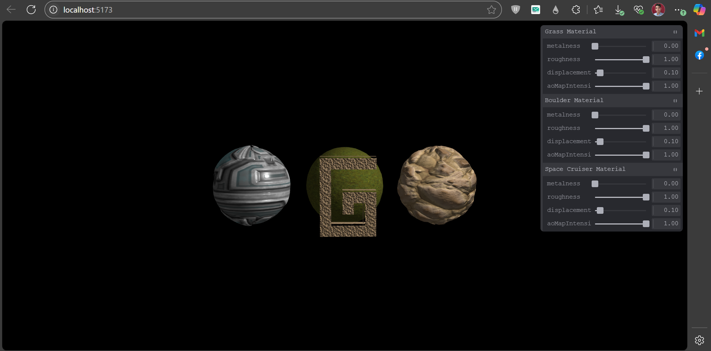
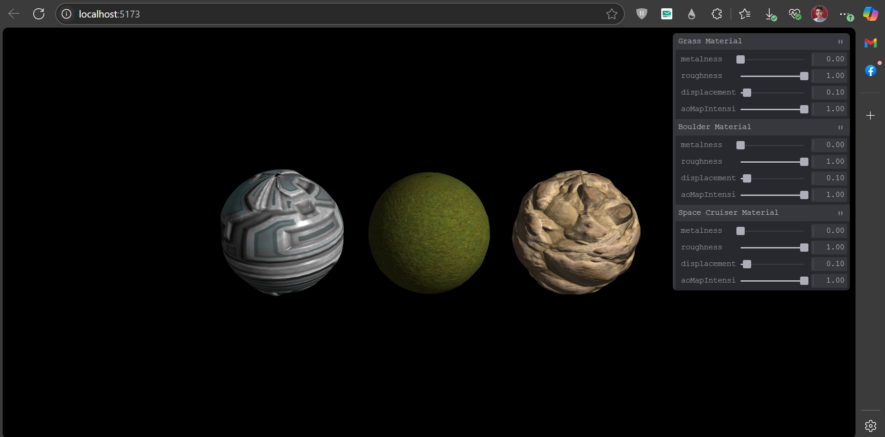

<h1 align="center">
  Escena 3D con Texturizado PBR en Three.js
</h1>
<a name="readme-top"></a>

<h4 align="center">
  Demostración de texturizado PBR avanzado en una escena 3D utilizando Three.js y Tweakpane.<br>
  Desarrollada en JavaScript.
</h4>


####  Para Fines Educativos y Demostración de Texturizado Avanzado


<h2 align="center">Descripción del Proyecto</h2>

<p align="center">
  Este proyecto demuestra la aplicación de texturas PBR (Physically Based Rendering) a objetos 3D en una escena creada con Three.js. Se muestran tres esferas, cada una con un conjunto distinto de mapas de textura (Albedo, Ambient Occlusion, Height/Displacement, Metallic, Normal y Roughness) para simular materiales realistas como hierba, roca y paneles de una nave espacial. La escena incluye iluminación ambiental y puntual, y controles de órbita para la interacción del usuario. Se utiliza Tweakpane para proporcionar una interfaz gráfica que permite ajustar dinámicamente varios parámetros de los materiales de cada objeto, como la intensidad del metalizado, la rugosidad, la escala de desplazamiento y la intensidad del mapa de oclusión ambiental.
</p>

<p align="center">
   
  
</p>

<h3 align="center">Creado por:</h3>
<p align="center">
  <a href="https://github.com/gabiru05">Gabriel Ruiz (gabiru05)</a>
</p>


<h2 align="center">Características Principales</h2>

<ul>
  <li> Carga y aplicación de múltiples mapas de textura PBR: Albedo, Ambient Occlusion (AO), Height (Displacement), Metallic, Normal y Roughness.</li>
  <li> Tres objetos 3D (Esferas) con diferentes materiales PBR (hierba, roca, paneles metálicos).</li>
  <li> Uso de <code>THREE.MeshStandardMaterial</code> para materiales físicamente correctos.</li>
  <li> Configuración del atributo <code>uv2</code> en la geometría para el correcto mapeo de texturas como AO y Displacement.</li>
  <li> Interfaz de usuario con Tweakpane para ajustar dinámicamente propiedades de los materiales por objeto:
    <ul>
      <li><code>metalness</code> (Intensidad del metalizado)</li>
      <li><code>roughness</code> (Rugosidad)</li>
      <li><code>displacementScale</code> (Escala de desplazamiento)</li>
      <li><code>aoMapIntensity</code> (Intensidad del mapa de oclusión ambiental)</li>
    </ul>
  </li>
  <li> Iluminación de la escena con Luz Ambiental (<code>AmbientLight</code>) y Luz Puntual (<code>PointLight</code>).</li>
  <li> Controles de Órbita (<code>OrbitControls</code>) para navegación interactiva (rotar, zoom, paneo).</li>
  <li> Diseño responsivo al tamaño de la ventana del navegador.</li>
  <li> Renderizado con anti-aliasing para bordes más suaves.</li>
</ul>


<h2 align="center">Estructura del Proyecto</h2>

<p align="center">
  El proyecto sigue una estructura típica para aplicaciones web con Vite y Three.js:
</p>

-   `index.html`: Archivo HTML principal que sirve como punto de entrada y contiene el lienzo para Three.js.
-   `src/`: Carpeta que contiene el código fuente principal.
    -   `script.js` (o `main.js`): Contiene toda la lógica de Three.js para configurar la escena, cámara, luces, cargadores de texturas, materiales, objetos, Tweakpane y el bucle de renderizado.
    -   `style.css` (opcional): Estilos CSS para la página.
-   `static/` (o `public/`): Carpeta que contiene los assets estáticos, como las texturas.
    -   `textures/`: Subcarpeta con los diferentes conjuntos de texturas PBR.
-   `vite.config.js`: Archivo de configuración para Vite.
-   `package.json`: Define las dependencias del proyecto y scripts.

> Para ejecutar el proyecto, necesitarás Node.js y npm (o yarn) instalados. Sigue las instrucciones de instalación y uso.


<h2 align="center">Tecnologías Utilizadas</h2>

<ul>
  <li> <strong>Three.js:</strong> Biblioteca principal para la creación de gráficos 3D en la web.</li>
  <li> <strong>JavaScript:</strong> Lenguaje de programación para la lógica de la aplicación.</li>
  <li> <strong>HTML5:</strong> Para la estructura de la página web.</li>
  <li><strong>Tweakpane:</strong> Biblioteca para crear paneles de control y depuración, utilizada activamente para modificar parámetros de materiales.</li>
  <li> <strong>Vite:</strong> Entorno de desarrollo rápido para JavaScript moderno, utilizado para servir el proyecto y gestionar las dependencias.</li>
</ul>


<h2 align="center">Instalación y Uso</h2>

1.  **Clonar el repositorio:**
    ```bash
    git clone [URL_DE_TU_REPOSITORIO_AQUI]
    cd [NOMBRE_DE_LA_CARPETA_DEL_PROYECTO]
    ```
    (Reemplaza `[URL_DE_TU_REPOSITORIO_AQUI]` y `[NOMBRE_DE_LA_CARPETA_DEL_PROYECTO]`)

2.  **Instalar dependencias:**
    Navega a la carpeta del proyecto y ejecuta:
    ```bash
    npm install 
    # o si usas yarn:
    # yarn install
    ```
3.  **Ejecutar el proyecto:**
    ```bash
    npm run dev
    # o si usas yarn:
    # yarn dev
    ```
    Esto iniciará el servidor de desarrollo de Vite. Abre la URL que aparece en la consola (generalmente `http://localhost:5173` o similar) en tu navegador.

4.  **Interactuar:**
    * Usa el ratón para rotar la cámara (clic izquierdo y arrastrar).
    * Usa la rueda del ratón para hacer zoom.
    * Usa el clic derecho (o clic central) y arrastrar para hacer paneo.
    * Utiliza los controles de Tweakpane (generalmente en la esquina superior derecha) para modificar las propiedades de los materiales de cada esfera.


<p align="right"><a href="#readme-top">Volver arriba</a></p>